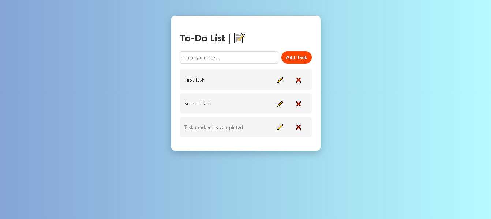

# 📝 To-Do List

A clean, simple, and responsive **To-Do List WebPage** built using **HTML, CSS, and JavaScript**. This project helps users add, mark as complete, edit, and delete their daily tasks efficiently.



---

## 🔗 Live Demo

👉 [View Live](https://suru190.github.io/To-Do-List/)

---

## 🚀 Features

- ✅ Add tasks to your list
- ✅ Mark tasks as complete/incomplete
- ✅ Edit tasks
- ✅ Delete tasks
- ✅ Responsive on mobile, tablet, and desktop
- ✅ Clean and modern UI with smooth transitions

---

## 🛠️ Tech Stack

- **HTML5**
- **CSS3**
- **JavaScript (Vanilla)**

---

## 📂 Folder Structure

```bash
To-Do-List/
│
├── index.html          # Main HTML file
├── style.css           # Styling file
├── script.js           # Functionality with JavaScript
├── desktop-view.png    # Screenshot of the project
└── README.md           # Project documentation
