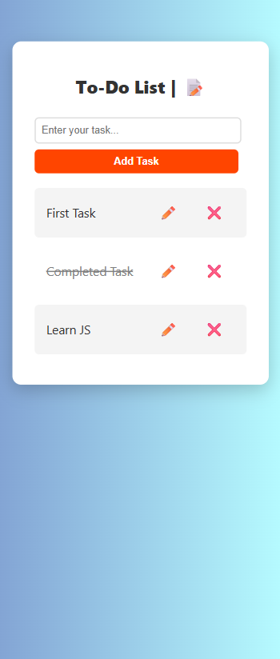

# 📝 To-Do List

A simple and creative To-Do List web page made using **HTML**, **CSS**, and **JavaScript**. You can add tasks, mark them as completed, or delete them easily with single or double clicks. It's responsive and works well on both desktop and mobile screens.

---

## 🚀 Live Demo

🔗 [Click here to view the live project](https://suru190.github.io/To-Do-List/)  

---

## ✨ Features

- Add new tasks using input and button.
- Click on a task to mark it as completed ✅.
- Double click to delete the task ❌.
- Mobile responsive design 📱.

---

## 🛠️ Tech Used

- HTML
- CSS (Responsive using media queries)
- JavaScript (DOM Manipulation, Events)

---

## 📸 Screenshots

### 💻 Desktop View

### 📱 Mobile View

---
